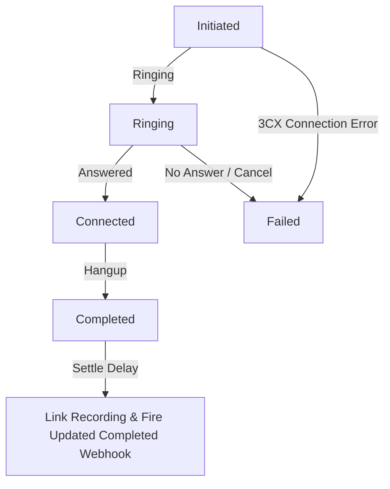

# 🔌 3CX Dialer Webhooks & Developer Documentation

This document explains the architecture, events lifecycle, webhook integration payloads, and call recording proxy mechanisms for the **3CX Dialer Widget**.

---

## 🌟 Overview

The Dialer Widget is designed to be embedded in external applications (such as **GoHighLevel**, custom CRM panels, or internal portals). When a call is triggered through the dialer, the system records the lifecycle of the call and automatically fires webhook events to user-configured HTTP endpoints. This enables external platforms to:
1. Track call activities in real time.
2. Link calls to contact records.
3. Automatically retrieve call recordings.
4. Update leads, record durations, or trigger automated workflows (via platforms like **n8n** or **Make**).

---

## 📂 Database Schema updates

Two primary models govern the dialer configurations and records in the database:

### 1. `DialerWidget`
Stores the styling, integration credentials, and webhook endpoints for a specific dialer instance:
- `webhook_initiated`: Webhook URL for when a call is requested/initiated.
- `webhook_connected`: Webhook URL for when the agent and customer connect.
- `webhook_completed`: Webhook URL for when the call ends (with call recording information attached).
- `webhook_failed`: Webhook URL for when a call fails, is cancelled, or goes unanswered.

### 2. `DialerCallRecord`
Stores history of each dialer-originated call:
- `id` (UUID): Unique ID for the call record.
- `agent_extension`: The 3CX extension of the agent who placed the call.
- `destination`: The phone number dialed.
- `status`: Lifecycle state (`Initiated` | `Ringing` | `Connected` | `Completed` | `Failed`).
- `duration_seconds`: Talk time in seconds.
- `ended_at`: Timestamp when the call finished.
- `recording_id`: 3CX recording ID (if resolved).

---

## 🔄 Call Lifecycle & Webhook Events



### 1. `Initiated`
- **Trigger**: Fired immediately when the frontend widget calls `/api/dialer/call`.
- **Use Case**: Logging that a call attempt has started in the CRM.

### 2. `Connected`
- **Trigger**: Fired when the system detects that both the agent and customer are talking.
- **Use Case**: Populating a live call card or triggering screen pops in the agent's CRM panel.

### 3. `Completed`
- **Trigger**: Fired when the call ends normally.
- **Note on Recording Linking**: A 5-second settle delay is initiated on completion to allow the 3CX PBX to write the recording file. The server searches recent recordings matching the destination phone number, extension, and close timestamps. If a recording is found, the call record is updated with the `recording_id`, and a new **Completed** webhook payload containing the secure proxy `recordingUrl` is fired.

### 4. `Failed`
- **Trigger**: Fired if the call fails to connect, is cancelled by the agent, or goes unanswered.

---

## 📦 Webhook Payload Formats

Webhooks are sent as `POST` requests with a `Content-Type: application/json` header.

### 1. Call Initiated Payload (`Initiated`)
```json
{
  "callId": "d3b07384-d113-41e9-a35b-d372fbf49581",
  "dialerId": "a9e64e10-6c92-491c-8e01-f2f6027ffb2a",
  "dialerName": "GoHighLevel Main Dialer",
  "agentExtension": "750",
  "destination": "+971501234567",
  "status": "Initiated",
  "durationSeconds": 0,
  "recordingId": null,
  "recordingUrl": null,
  "recordingListenUrl": null,
  "endedAt": null,
  "timestamp": "2026-07-15T14:54:00.000Z"
}
```

### 2. Call Connected Payload (`Connected`)
```json
{
  "callId": "d3b07384-d113-41e9-a35b-d372fbf49581",
  "dialerId": "a9e64e10-6c92-491c-8e01-f2f6027ffb2a",
  "dialerName": "GoHighLevel Main Dialer",
  "agentExtension": "750",
  "destination": "+971501234567",
  "status": "Connected",
  "durationSeconds": 0,
  "recordingId": null,
  "recordingUrl": null,
  "recordingListenUrl": null,
  "endedAt": null,
  "timestamp": "2026-07-15T14:54:12.000Z"
}
```

### 3. Call Completed Payload (`Completed` - Without Recording)
Sent immediately when the call hangs up.
```json
{
  "callId": "d3b07384-d113-41e9-a35b-d372fbf49581",
  "dialerId": "a9e64e10-6c92-491c-8e01-f2f6027ffb2a",
  "dialerName": "GoHighLevel Main Dialer",
  "agentExtension": "750",
  "destination": "+971501234567",
  "status": "Completed",
  "durationSeconds": 45,
  "recordingId": null,
  "recordingUrl": null,
  "recordingListenUrl": null,
  "endedAt": "2026-07-15T14:54:57.000Z",
  "timestamp": "2026-07-15T14:54:57.000Z"
}
```

### 4. Call Completed Payload (`Completed` - With Recording Linked)
Sent after the 5-second settle delay if a matching recording is identified on the 3CX PBX.
```json
{
  "callId": "d3b07384-d113-41e9-a35b-d372fbf49581",
  "dialerId": "a9e64e10-6c92-491c-8e01-f2f6027ffb2a",
  "dialerName": "GoHighLevel Main Dialer",
  "agentExtension": "750",
  "destination": "+971501234567",
  "status": "Completed",
  "durationSeconds": 45,
  "recordingId": "66804",
  "recordingUrl": "https://widget-builder-domain.com/api/admin/dialers/a9e64e10-6c92-491c-8e01-f2f6027ffb2a/recordings/66804/download?token=eyJhbGciOiJIUzI1NiIsInR5cCI6IkpXVCJ9...",
  "recordingListenUrl": "https://widget-builder-domain.com/api/admin/dialers/a9e64e10-6c92-491c-8e01-f2f6027ffb2a/recordings/66804/listen?token=eyJhbGciOiJIUzI1NiIsInR5cCI6IkpXVCJ9...",
  "endedAt": "2026-07-15T14:54:57.000Z",
  "timestamp": "2026-07-15T14:55:02.000Z"
}
```

### 5. Call Failed Payload (`Failed`)
```json
{
  "callId": "d3b07384-d113-41e9-a35b-d372fbf49581",
  "dialerId": "a9e64e10-6c92-491c-8e01-f2f6027ffb2a",
  "dialerName": "GoHighLevel Main Dialer",
  "agentExtension": "750",
  "destination": "+971501234567",
  "status": "Failed",
  "durationSeconds": 0,
  "recordingId": null,
  "recordingUrl": null,
  "recordingListenUrl": null,
  "endedAt": "2026-07-15T14:54:10.000Z",
  "timestamp": "2026-07-15T14:54:10.000Z"
}
```

---

## 🔒 Call Recording Security & Proxy Downloader

Because 3CX recording files require admin OAuth tokens to download, exposing raw 3CX tokens or direct URLs to a CRM or external system is a high security risk. 

To resolve this, the **3CX Call Widget Builder** implements a **signed JWT proxy mechanism**:
1. When a recording is linked to a dialer call, the server signs a secure, non-expiring JWT token scoped specifically for that single recording:
   - Claims: `{ dialerId, recId, role: 'dialer_download' }`
2. The server constructs a proxy download URL:
   - `https://[your-app-domain]/api/admin/dialers/[dialer-id]/recordings/[recording-id]/download?token=[signed-token]`
3. When the CRM requests this URL, the server verifies the signature and scope, gets a temporary access token for the 3CX FQDN, downloads the recording stream, and pipes it back to the requester.

This keeps your 3CX credentials fully secure within the backend.

---

## 🛠️ n8n / GoHighLevel Integration Guide

Integrating this into platforms like **n8n** or **GoHighLevel** is simple:

### Step 1: Create Webhook URLs in n8n
1. Create a new workflow in n8n.
2. Add a **Webhook node** set to `POST` request method.
3. Copy the production/test webhook URL.

### Step 2: Configure Dialer Widget
1. Log in to the 3CX Widget Admin Panel.
2. Go to **Dialer Widgets** and edit your dialer.
3. Paste the n8n webhook URL into the event configurations (e.g. **Call Completed Webhook URL**).
4. Save changes.

### Step 3: Map payloads in n8n / GoHighLevel
When a call completes, n8n receives the JSON payload. You can add a **GoHighLevel node** to find/create the contact by phone number and add a call record containing the call duration, status, and the `recordingUrl` so sales managers can listen to it directly from the contact's activity timeline.
