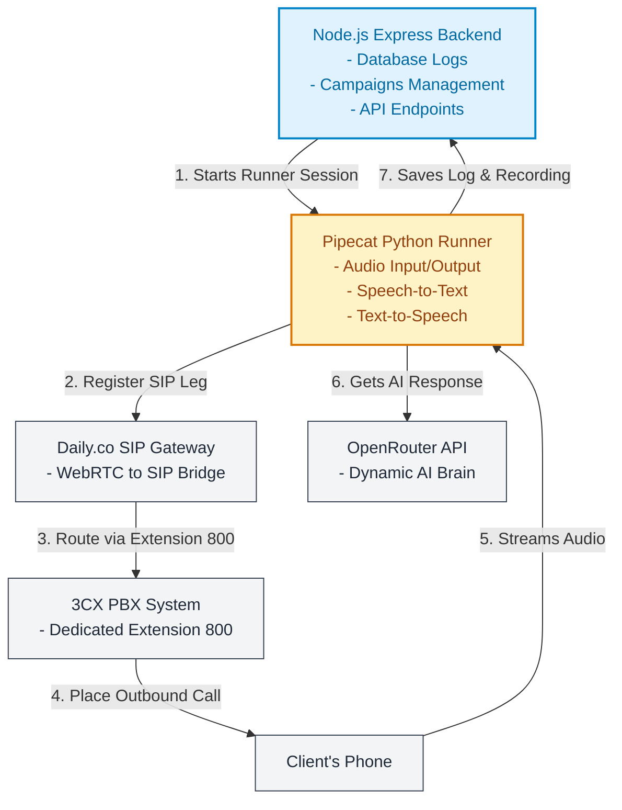

# Comprehensive Implementation Plan: AI Auto-Calling & Dynamic IVR

This document outlines the detailed, step-by-step technical plan for integrating an automated AI Calling and Dynamic Interactive Voice Response (IVR) feature into the 3CX Call Widget application.

---

## 🏗️ 1. Architecture & Integration Strategy

We will use a **hybrid double-engine microservice model** to handle the web dashboard (Node.js/Express) and real-time audio streaming (Python/Pipecat).



### 3CX Extension Configuration
1. **Dedicated AI Extension**: In the 3CX PBX console, we will create a dedicated SIP Extension (e.g., Extension `800` named "AI Voice Assistant").
2. **Telephony Bridge**: The **Pipecat Python Runner** registers to Extension `800` using standard SIP credentials.
3. **Outbound Call Triggering**: When a call is triggered, the Express backend calls the 3CX API (`/makecall`) to bridge Extension `800` (the AI agent) with the destination client's phone number.
4. **Scale Options**:
   - **For Single calls**: A single active registration on Extension `800` is sufficient.
   - **For Concurrent calls**: We can register multiple extensions (e.g., `800-805`) as an agent pool, or configure a dedicated **SIP Trunk** in 3CX to handle multiple simultaneous channels.

---

## 🎨 2. Visual Call Flow

Here is a visual breakdown of how the call operates from start to finish:


### Step-by-Step Flow:
1. **Trigger**: An external CRM, API call, or the dashboard triggers a call request.
2. **Connect**: The Express backend initializes the Pipecat agent. Pipecat connects to the 3CX Phone System through the Daily SIP gateway using the credentials for Extension `800`.
3. **Talk**: 3CX dials the client. When the client answers, they speak directly to the AI.
4. **Brain**: The AI listens, transcribes the speech via Deepgram, asks **OpenRouter** for an intelligent response based on the custom situation prompt, converts the response to audio via ElevenLabs, and plays it back to the client.
5. **Log**: When the call completes, Pipecat sends the final transcript, duration, and recording link to the Express server webhook, which updates the database.

---

## 📂 3. Database Updates (`db.js`)

We will add two new Sequelize models to `db.js`:

```javascript
// 1. Campaign / Situation definition
const AICallCampaign = sequelize.define('AICallCampaign', {
  id: {
    type: DataTypes.UUID,
    defaultValue: DataTypes.UUIDV4,
    primaryKey: true,
  },
  name: {
    type: DataTypes.STRING,
    allowNull: false,
  },
  system_prompt: {
    type: DataTypes.TEXT,
    allowNull: false, // The dynamic situation context
  },
  initial_greeting: {
    type: DataTypes.STRING,
    allowNull: false, // The opening line (e.g., "Hello, this is Sarah from Acme Corp...")
  },
  openrouter_model: {
    type: DataTypes.STRING,
    defaultValue: 'google/gemini-2-flash', // Model name for OpenRouter API
  },
  voice_provider: {
    type: DataTypes.STRING,
    defaultValue: 'elevenlabs', // elevenlabs | cartesia | openai
  },
  voice_id: {
    type: DataTypes.STRING,
    defaultValue: '21m00Tcm4TlvDq8ikWAM', // Default Rachel voice ID
  },
  temperature: {
    type: DataTypes.FLOAT,
    defaultValue: 0.7,
  }
});

// 2. Individual Call Log Records
const AICallRecord = sequelize.define('AICallRecord', {
  id: {
    type: DataTypes.UUID,
    defaultValue: DataTypes.UUIDV4,
    primaryKey: true,
  },
  destination: {
    type: DataTypes.STRING,
    allowNull: false, // Target customer phone number
  },
  customer_name: {
    type: DataTypes.STRING,
    allowNull: true,
  },
  status: {
    type: DataTypes.STRING,
    defaultValue: 'Initiated', // Initiated | Connected | Completed | Failed
  },
  duration_seconds: {
    type: DataTypes.INTEGER,
    allowNull: true,
  },
  transcript: {
    type: DataTypes.JSON, // Stores the array: [{role: 'user'|'assistant', text: String, timestamp: Date}]
    allowNull: true,
  },
  summary: {
    type: DataTypes.TEXT, // AI summary of the conversation outcome
    allowNull: true,
  },
  recording_url: {
    type: DataTypes.STRING,
    allowNull: true,
  },
  ended_at: {
    type: DataTypes.DATE,
    allowNull: true,
  }
});

// Relationships
AICallCampaign.hasMany(AICallRecord, { foreignKey: 'campaignId', onDelete: 'CASCADE' });
AICallRecord.belongsTo(AICallCampaign, { foreignKey: 'campaignId' });
```

---

## 🔌 4. API Endpoints (`server.js`)

We will expose the following endpoints on our Express backend:

### Campaign Management:
*   `POST /api/ai-calls/campaigns`
    - **Request**: `{ name, system_prompt, initial_greeting, openrouter_model, voice_id }`
    - **Response**: `{ success: true, campaign: Object }`
*   `GET /api/ai-calls/campaigns`
    - **Response**: List of campaigns.

### Outbound Call Control:
*   `POST /api/ai-calls/trigger`
    - **Request**: `{ campaignId, destination, customerName, variables: { ... } }`
    - **Logic**:
      1. Fetch campaign and replace template placeholders in the system prompt and initial greeting (e.g., replacing `[Customer Name]` with `customerName`).
      2. Call the 3CX API (`/callcontrol/800/makecall`) to place the call between the AI extension (`800`) and the `destination`.
      3. Spawn the Pipecat agent process with the runtime parameters.
      4. Log an `AICallRecord` as `Initiated`.
    - **Response**: `{ success: true, callId: UUID }`

### Call Telemetry Webhook:
*   `POST /api/ai-calls/webhook`
    - **Request**: `{ callId, duration, transcript, recording_url, summary }`
    - **Logic**: Fired by Pipecat when the call concludes. Saves the transcript, duration, recording URL, and final call outcome to the DB.
    - **Response**: `{ success: true }`

---

## 🐍 5. Pipecat Runner (`ai-runner/pipecat_agent.py`)

A standalone Python script will be created to manage the audio pipeline session:
- **Dependencies**: `pipecat-ai`, `daily-python`, `websockets`, `pydantic`.
- **Telephony Transport**: `DailyTransport` configured with SIP credentials for Extension `800`.
- **Speech Pipeline**:
  - `DeepgramSTTService` for low-latency voice transcription.
  - `OpenRouterLLMService` (wrapping Pipecat's OpenAI provider to point to OpenRouter URL).
  - `ElevenLabsTTSService` for realistic voice responses.
- **Interruption Handling**: Pipecat's VAD (Voice Activity Detection) immediately halts the bot's speech output if the customer begins talking.

---

## 🎨 6. Admin Panel UI Updates

We will add a new workspace view in the admin Vue dashboard:
1. **AI Campaigns Tab**:
   - Settings page to configure OpenRouter API keys.
   - Builder UI to write the campaign's "situation prompt", set default models (e.g., Llama-3-70b, GPT-4o-mini), customize the initial greeting, and select the voice style.
2. **AI Dial History Tab**:
   - Overview list of calls made with status chips (`Initiated` / `Connected` / `Completed` / `Failed`).
   - Click-to-expand details showing the complete transcript log (color-coded, side-by-side chat view) and an audio player for call recordings.

---

## 🚦 7. Verification Plan

### Step 1: Database Migration
- Run the backend server and verify tables `AICallCampaigns` and `AICallRecords` are automatically created in the MySQL database.

### Step 2: OpenRouter Integration Test
- Create a test script `/scratch/test_openrouter.js` to send a prompt to OpenRouter and verify response generation.

### Step 3: SIP Registration & Webhook Test
- Manually post a mock webhook payload to `/api/ai-calls/webhook` and verify it updates the `AICallRecord` with duration, transcript, and recording.

---

## 💬 Decision Points

1. **Daily.co SIP Registration**: Daily.co requires your 3CX PBX FQDN and credentials for SIP registration.
2. **Security**: We can configure API key security for the trigger endpoints to prevent unauthorized external triggers.
